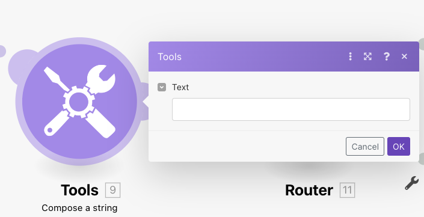

# The Kotlin client

Here is what you can do with the client:
* [Create a new client instance](#instantiate-the-client)
* [Create a scenario](#create-a-scenario)
* [Create a scenario from an encoded blueprint](#create-a-scenario-from-an-encoded-blueprint)
* [Create a scenario from a file](#create-a-scenario-from-a-file)
* [Update a scenario](#update-scenario)
* [Update a scenario from an encoded blueprint](#update-a-scenario-from-an-encoded-blueprint)
* [Update a scenario from a file](#update-a-scenario-from-a-file)
* [Get a scenario blueprint](#get-a-scenario-blueprint)
* [Get blueprints of multiple scenarios](#get-blueprints-of-multiple-scenarios)
* [Set module data](#set-module-data)
* [Set data for multiple modules](#set-data-for-multiple-modules)


### Instantiate the client

```kotlin
    // Connects to eu1.make.com
    val makeClient = MakeClient.eu("REPLACE-WITH-YOUR-API-KEY")

    // Connects to us1.make.com
    val makeClient = MakeClient.us("REPLACE-WITH-YOUR-API-KEY")
```

### Create a scenario

```kotlin
    makeClient.createScenario(
        Scenario.TeamId(55228),
        Scenario.FolderId(22143),
        Blueprint.Json(
            "{ \"name\": \"Empty integration\", \"flow\": [ { \"id\": 2, \"module\": \"json:ParseJSON\", \"version\": 1, \"metadata\": { \"designer\": { \"x\": -46, \"y\": 47, \"messages\": [ { \"category\": \"last\", \"severity\": \"warning\", \"message\": \"A transformer should not be the last module in the route.\" } ] } } } ], \"metadata\": { \"version\": 1, \"scenario\": { \"roundtrips\": 1, \"maxErrors\": 3, \"autoCommit\": true, \"autoCommitTriggerLast\": true, \"sequential\": false, \"confidential\": false, \"dataloss\": false, \"dlq\": false }, \"designer\": { \"orphans\": [ ] } } }"
        )
    ).onSuccess {
        println(it)
        // Scenario(id=Id(value=476210), teamId=TeamId(value=55228), folderId=FolderId(value=22143), name=Empty scenario)
    }.onFailure {
        it.printStackTrace()
    }
```

### Create a scenario from an encoded blueprint
Blueprint as a plain-text piece of JSON can get unwieldy. It's large, and it might be hard to correctly escape it.

You have an option to provide a Base64-encoded string instead.
```kotlin
    makeClient.createScenario(
        Scenario.TeamId(55228),
        Scenario.FolderId(22143),
        Blueprint.Json(
            "InsgXCJuYW1lXCI6IFwiRW1wdHkgaW50ZWdyYXRpb25cIiwgXCJmbG93XCI6IFsgeyBcImlkXCI6IDIsIFwibW9kdWxlXCI6IFwianNvbjpQYXJzZUpTT05cIiwgXCJ2ZXJzaW9uXCI6IDEsIFwibWV0YWRhdGFcIjogeyBcImRlc2lnbmVyXCI6IHsgXCJ4XCI6IC00NiwgXCJ5XCI6IDQ3LCBcIm1lc3NhZ2VzXCI6IFsgeyBcImNhdGVnb3J5XCI6IFwibGFzdFwiLCBcInNldmVyaXR5XCI6IFwid2FybmluZ1wiLCBcIm1lc3NhZ2VcIjogXCJBIHRyYW5zZm9ybWVyIHNob3VsZCBub3QgYmUgdGhlIGxhc3QgbW9kdWxlIGluIHRoZSByb3V0ZS5cIiB9IF0gfSB9IH0gXSwgXCJtZXRhZGF0YVwiOiB7IFwidmVyc2lvblwiOiAxLCBcInNjZW5hcmlvXCI6IHsgXCJyb3VuZHRyaXBzXCI6IDEsIFwibWF4RXJyb3JzXCI6IDMsIFwiYXV0b0NvbW1pdFwiOiB0cnVlLCBcImF1dG9Db21taXRUcmlnZ2VyTGFzdFwiOiB0cnVlLCBcInNlcXVlbnRpYWxcIjogZmFsc2UsIFwiY29uZmlkZW50aWFsXCI6IGZhbHNlLCBcImRhdGFsb3NzXCI6IGZhbHNlLCBcImRscVwiOiBmYWxzZSB9LCBcImRlc2lnbmVyXCI6IHsgXCJvcnBoYW5zXCI6IFsgXSB9IH0gfSI=",
            encoded = true
        )
    ).onSuccess {
        println(it)
        // Scenario(id=Id(value=476211), teamId=TeamId(value=55228), folderId=FolderId(value=22143), name=Empty scenario)
    }.onFailure {
        it.printStackTrace()
    }
```

### Create a scenario from a file
Working with a client brings Make much closer to your code, and your local filesystem. The ability to create a new scenario
out of a blueprint stored somewhere on your disk is a no-brainer.

```kotlin
    makeClient.createScenario(
        Scenario.TeamId(55228),
        Scenario.FolderId(22143),
        Path.of(Config.getResource("blueprint.json").toURI())
    ).onSuccess {
        println(it)
        // Scenario(id=Id(value=476212), teamId=TeamId(value=55228), folderId=FolderId(value=22143), name=Empty scenario)
    }.onFailure {
        it.printStackTrace()
    }
```

### Update scenario

There is a scenario, but you are not happy with how it got created? No problem, simply replace it with a new blueprint.

```kotlin
    makeClient.updateScenario(
        Scenario.Id(473703),
        Blueprint.Json(
            "{ \"name\": \"Empty integration\", \"flow\": [ { \"id\": 2, \"module\": \"json:ParseJSON\", \"version\": 1, \"metadata\": { \"designer\": { \"x\": -46, \"y\": 47, \"messages\": [ { \"category\": \"last\", \"severity\": \"warning\", \"message\": \"A transformer should not be the last module in the route.\" } ] } } } ], \"metadata\": { \"version\": 1, \"scenario\": { \"roundtrips\": 1, \"maxErrors\": 3, \"autoCommit\": true, \"autoCommitTriggerLast\": true, \"sequential\": false, \"confidential\": false, \"dataloss\": false, \"dlq\": false }, \"designer\": { \"orphans\": [ ] } } }"
        )
    ).onSuccess {
        println(it)
        // Scenario(id=Id(value=473703), teamId=TeamId(value=55228), folderId=FolderId(value=22143), name=Updated integration)
    }.onFailure {
        it.printStackTrace()
    }
```

### Update a scenario from an encoded blueprint

```kotlin
    makeClient.updateScenario(
        Scenario.Id(473703),
        Blueprint.Json(
            "InsgXCJuYW1lXCI6IFwiRW1wdHkgaW50ZWdyYXRpb25cIiwgXCJmbG93XCI6IFsgeyBcImlkXCI6IDIsIFwibW9kdWxlXCI6IFwianNvbjpQYXJzZUpTT05cIiwgXCJ2ZXJzaW9uXCI6IDEsIFwibWV0YWRhdGFcIjogeyBcImRlc2lnbmVyXCI6IHsgXCJ4XCI6IC00NiwgXCJ5XCI6IDQ3LCBcIm1lc3NhZ2VzXCI6IFsgeyBcImNhdGVnb3J5XCI6IFwibGFzdFwiLCBcInNldmVyaXR5XCI6IFwid2FybmluZ1wiLCBcIm1lc3NhZ2VcIjogXCJBIHRyYW5zZm9ybWVyIHNob3VsZCBub3QgYmUgdGhlIGxhc3QgbW9kdWxlIGluIHRoZSByb3V0ZS5cIiB9IF0gfSB9IH0gXSwgXCJtZXRhZGF0YVwiOiB7IFwidmVyc2lvblwiOiAxLCBcInNjZW5hcmlvXCI6IHsgXCJyb3VuZHRyaXBzXCI6IDEsIFwibWF4RXJyb3JzXCI6IDMsIFwiYXV0b0NvbW1pdFwiOiB0cnVlLCBcImF1dG9Db21taXRUcmlnZ2VyTGFzdFwiOiB0cnVlLCBcInNlcXVlbnRpYWxcIjogZmFsc2UsIFwiY29uZmlkZW50aWFsXCI6IGZhbHNlLCBcImRhdGFsb3NzXCI6IGZhbHNlLCBcImRscVwiOiBmYWxzZSB9LCBcImRlc2lnbmVyXCI6IHsgXCJvcnBoYW5zXCI6IFsgXSB9IH0gfSI=",
            encoded = true
        )
    ).onSuccess {
        println(it)
        // Scenario(id=Id(value=473703), teamId=TeamId(value=55228), folderId=FolderId(value=22143), name=Updated integration)
    }.onFailure {
        it.printStackTrace()
    }
```

### Update a scenario from a file

```kotlin
    makeClient.updateScenario(
        Scenario.Id(473703),
        Path.of(Config.getResource("blueprint-updated.json").toURI())
    ).onSuccess {
        println(it)
        // Scenario(id=Id(value=473703), teamId=TeamId(value=55228), folderId=FolderId(value=22143), name=Updated integration)
    }.onFailure {
        it.printStackTrace()
    }
```

### Get a scenario blueprint

Sometimes you simply want to download a scenario's definition, the blueprint.

```kotlin
    makeClient.getBlueprint(Scenario.Id(471310))
        .onSuccess {
            println(it)
            // Blueprint(name=New scenario, modules=[Module(id=Id(value=5), name=util:SetVariable2), Module(id=Id(value=9), name=util:ComposeTransformer), Module(id=Id(value=12), name=util:ComposeTransformer), Module(id=Id(value=13), name=json:ParseJSON), Module(id=Id(value=10), name=util:ComposeTransformer)], json=Json(value={"flow":[{"id":5,"mapper":{"qs":[],"name":"greeting","scope":"execution","value":"Hello world!","headers":[]},"module":"util:SetVariable2","onerror":[],"version":1,"metadata":{"expect":[{"name":"name","type":"text","label":"Variable name","required":true},{"name":"scope","type":"select","label":"Variable lifetime","required":true,"validate":{"enum":["roundtrip","execution"]}},{"name":"value","type":"any","label":"Variable value"}],"restore":{"expect":{"scope":{"label":"One execution"}}},"designer":{"x":-822,"y":90},"interface":[{"name":"greeting","type":"any","label":"greeting"}],"parameters":[]},"parameters":{}},{"id":6,"module":"builtin:BasicRouter","routes":[{"flow":[{"id":9,"mapper":{"value":"{{5.greeting}}"},"module":"util:ComposeTransformer","version":1,"metadata":{"expect":[{"name":"value","type":"text","label":"Text"}],"restore":{},"designer":{"x":-98,"y":94}},"parameters":{}},{"id":11,"mapper":null,"module":"builtin:BasicRouter","routes":[{"flow":[{"id":12,"mapper":{"value":"{{5.greeting}}"},"module":"util:ComposeTransformer","version":1,"metadata":{"expect":[{"name":"value","type":"text","label":"Text"}],"restore":{},"designer":{"x":502,"y":-56,"messages":[{"message":"A transformer should not be the last module in the route.","category":"last","severity":"warning"}]}},"parameters":{}}]},{"flow":[{"id":13,"mapper":{"json":"{{5.greeting}}"},"module":"json:ParseJSON","version":1,"metadata":{"expect":[{"name":"json","type":"text","label":"JSON string","required":true}],"restore":{"parameters":{"type":{"label":"Choose a data structure"}}},"designer":{"x":502,"y":244,"messages":[{"message":"A transformer should not be the last module in the route.","category":"last","severity":"warning"}]},"parameters":[{"name":"type","type":"udt","label":"Data structure"}]},"parameters":{"type":""}}]}],"version":1,"metadata":{"designer":{"x":202,"y":94}}}]},{"flow":[{"id":10,"mapper":{"value":"{{5.greeting}}"},"module":"util:ComposeTransformer","version":1,"metadata":{"expect":[{"name":"value","type":"text","label":"Text"}],"restore":{},"designer":{"x":-438,"y":252,"messages":[{"message":"A transformer should not be the last module in the route.","category":"last","severity":"warning"}]}},"parameters":{}}]}],"onerror":[],"version":1,"metadata":{"expect":[],"designer":{"x":-423,"y":-111},"parameters":[]}}],"name":"New scenario","metadata":{"instant":false,"version":1,"designer":{"orphans":[],"samples":{"5":{"greeting":"Hello world!..."},"9":{"value":"Hello world!..."}}},"scenario":{"dlq":false,"dataloss":false,"maxErrors":3,"autoCommit":true,"roundtrips":1,"sequential":false,"confidential":false,"autoCommitTriggerLast":true}}}, encoded=false))
        }.onFailure {
            it.printStackTrace()
        }
```

The result is not just a mere blueprint as a JSON string. You also get a list of all modules the scenario consists of:
```kotlin
Blueprint(
    name="New scenario", 
    modules=[
        Module(id=Id(5), name="util:SetVariable2"), 
        Module(id=Id(9), name="util:ComposeTransformer"), 
        Module(id=Id(12), name="util:ComposeTransformer"), 
        Module(id=Id(13), name="json:ParseJSON"), 
        Module(id=Id(10), name="util:ComposeTransformer")
    ], json=Json(
        """
            {"flow":[{"id":5,"mapper":{"qs":[],"name":"greeting","scope":"execution","value":"Hello world!","headers":[]},"module":"util:SetVariable2","onerror":[],"version":1,"metadata":{"expect":[{"name":"name","type":"text","label":"Variable name","required":true},{"name":"scope","type":"select","label":"Variable lifetime","required":true,"validate":{"enum":["roundtrip","execution"]}},{"name":"value","type":"any","label":"Variable value"}],"restore":{"expect":{"scope":{"label":"One execution"}}},"designer":{"x":-822,"y":90},"interface":[{"name":"greeting","type":"any","label":"greeting"}],"parameters":[]},"parameters":{}},{"id":6,"module":"builtin:BasicRouter","routes":[{"flow":[{"id":9,"mapper":{"value":"{{5.greeting}}"},"module":"util:ComposeTransformer","version":1,"metadata":{"expect":[{"name":"value","type":"text","label":"Text"}],"restore":{},"designer":{"x":-98,"y":94}},"parameters":{}},{"id":11,"mapper":null,"module":"builtin:BasicRouter","routes":[{"flow":[{"id":12,"mapper":{"value":"{{5.greeting}}"},"module":"util:ComposeTransformer","version":1,"metadata":{"expect":[{"name":"value","type":"text","label":"Text"}],"restore":{},"designer":{"x":502,"y":-56,"messages":[{"message":"A transformer should not be the last module in the route.","category":"last","severity":"warning"}]}},"parameters":{}}]},{"flow":[{"id":13,"mapper":{"json":"{{5.greeting}}"},"module":"json:ParseJSON","version":1,"metadata":{"expect":[{"name":"json","type":"text","label":"JSON string","required":true}],"restore":{"parameters":{"type":{"label":"Choose a data structure"}}},"designer":{"x":502,"y":244,"messages":[{"message":"A transformer should not be the last module in the route.","category":"last","severity":"warning"}]},"parameters":[{"name":"type","type":"udt","label":"Data structure"}]},"parameters":{"type":""}}]}],"version":1,"metadata":{"designer":{"x":202,"y":94}}}]},{"flow":[{"id":10,"mapper":{"value":"{{5.greeting}}"},"module":"util:ComposeTransformer","version":1,"metadata":{"expect":[{"name":"value","type":"text","label":"Text"}],"restore":{},"designer":{"x":-438,"y":252,"messages":[{"message":"A transformer should not be the last module in the route.","category":"last","severity":"warning"}]}},"parameters":{}}]}],"onerror":[],"version":1,"metadata":{"expect":[],"designer":{"x":-423,"y":-111},"parameters":[]}}],"name":"New scenario","metadata":{"instant":false,"version":1,"designer":{"orphans":[],"samples":{"5":{"greeting":"Hello world!..."},"9":{"value":"Hello world!..."}}},"scenario":{"dlq":false,"dataloss":false,"maxErrors":3,"autoCommit":true,"roundtrips":1,"sequential":false,"confidential":false,"autoCommitTriggerLast":true}}}, encoded=false)
        """
    )
)
```

### Get blueprints of multiple scenarios

You can also get blueprints of multiple scenarios in a single call.

```kotlin
    makeClient.getBlueprints(
        listOf(
            Scenario.Id(473703),
            Scenario.Id(471310),
        )
    ).onSuccess {
        println(it)
        // [
        //   Blueprint(name=Updated integration, modules=[Module(id=Id(value=2), name=json:ParseJSON), Module(id=Id(value=3), name=util:ComposeTransformer)], json=Json(value={"flow":[{"id":2,"mapper":{"qs":[],"json":"bbb","headers":[]},"module":"json:ParseJSON","onerror":[],"version":1,"metadata":{"expect":[{"name":"json","type":"text","label":"JSON string","required":true}],"restore":{"parameters":{"type":{"label":"Choose a data structure"}}},"designer":{"x":-46,"y":47},"parameters":[{"name":"type","type":"udt","label":"Data structure"}]},"parameters":{"type":""}},{"id":3,"mapper":{"qs":[],"value":"ccc","headers":[]},"module":"util:ComposeTransformer","onerror":[],"version":1,"metadata":{"expect":[{"name":"value","type":"text","label":"Text"}],"restore":{},"designer":{"x":376,"y":34,"messages":[{"message":"A transformer should not be the last module in the route.","category":"last","severity":"warning"}]}},"parameters":{}}],"name":"Updated integration","metadata":{"zone":"eu1.make.com","instant":false,"version":1,"designer":{"orphans":[]},"scenario":{"dlq":false,"dataloss":false,"maxErrors":3,"autoCommit":true,"roundtrips":1,"sequential":false,"confidential":false,"autoCommitTriggerLast":true}}}, encoded=false)), 
        //   Blueprint(name=New scenario, modules=[Module(id=Id(value=5), name=util:SetVariable2), Module(id=Id(value=9), name=util:ComposeTransformer), Module(id=Id(value=12), name=util:ComposeTransformer), Module(id=Id(value=13), name=json:ParseJSON), Module(id=Id(value=10), name=util:ComposeTransformer)], json=Json(value={"flow":[{"id":5,"mapper":{"qs":[],"name":"greeting","scope":"execution","value":"Hello world!","headers":[]},"module":"util:SetVariable2","onerror":[],"version":1,"metadata":{"expect":[{"name":"name","type":"text","label":"Variable name","required":true},{"name":"scope","type":"select","label":"Variable lifetime","required":true,"validate":{"enum":["roundtrip","execution"]}},{"name":"value","type":"any","label":"Variable value"}],"restore":{"expect":{"scope":{"label":"One execution"}}},"designer":{"x":-822,"y":90},"interface":[{"name":"greeting","type":"any","label":"greeting"}],"parameters":[]},"parameters":{}},{"id":6,"module":"builtin:BasicRouter","routes":[{"flow":[{"id":9,"mapper":{"value":"{{5.greeting}}"},"module":"util:ComposeTransformer","version":1,"metadata":{"expect":[{"name":"value","type":"text","label":"Text"}],"restore":{},"designer":{"x":-98,"y":94}},"parameters":{}},{"id":11,"mapper":null,"module":"builtin:BasicRouter","routes":[{"flow":[{"id":12,"mapper":{"value":"{{5.greeting}}"},"module":"util:ComposeTransformer","version":1,"metadata":{"expect":[{"name":"value","type":"text","label":"Text"}],"restore":{},"designer":{"x":502,"y":-56,"messages":[{"message":"A transformer should not be the last module in the route.","category":"last","severity":"warning"}]}},"parameters":{}}]},{"flow":[{"id":13,"mapper":{"json":"{{5.greeting}}"},"module":"json:ParseJSON","version":1,"metadata":{"expect":[{"name":"json","type":"text","label":"JSON string","required":true}],"restore":{"parameters":{"type":{"label":"Choose a data structure"}}},"designer":{"x":502,"y":244,"messages":[{"message":"A transformer should not be the last module in the route.","category":"last","severity":"warning"}]},"parameters":[{"name":"type","type":"udt","label":"Data structure"}]},"parameters":{"type":""}}]}],"version":1,"metadata":{"designer":{"x":202,"y":94}}}]},{"flow":[{"id":10,"mapper":{"value":"{{5.greeting}}"},"module":"util:ComposeTransformer","version":1,"metadata":{"expect":[{"name":"value","type":"text","label":"Text"}],"restore":{},"designer":{"x":-438,"y":252,"messages":[{"message":"A transformer should not be the last module in the route.","category":"last","severity":"warning"}]}},"parameters":{}}]}],"onerror":[],"version":1,"metadata":{"expect":[],"designer":{"x":-423,"y":-111},"parameters":[]}}],"name":"New scenario","metadata":{"instant":false,"version":1,"designer":{"orphans":[],"samples":{"5":{"greeting":"Hello world!..."},"9":{"value":"Hello world!..."}}},"scenario":{"dlq":false,"dataloss":false,"maxErrors":3,"autoCommit":true,"roundtrips":1,"sequential":false,"confidential":false,"autoCommitTriggerLast":true}}}, encoded=false))
        // ]
}.onFailure {
        it.printStackTrace()
    }
```

### Set module data

Ultimately, you want to have a more fine-grained control over an existing scenario. Each scenario comprises a bunch of modules.
You have the power to replace the content of a selected module.

For example, suppose there is a [Compose a String](https://www.make.com/en/help/tools/tools#compose-a-string) transformer with your scenario.
The [Get Blueprint](#get-a-scenario-blueprint) call reveals that the module is identified as a module number `9` within the scenario.

With the call below we assign the transformer with a reference to a local variable called `greeting`.

```kotlin
    makeClient.setModuleData(
        Scenario.Id(471310),
        Blueprint.Module.Id(9),
        "value",
        "{{5.greeting}}"
    ).onSuccess {
        println(it)
        // UpdateResult(result=true)
    }.onFailure {
        it.printStackTrace()
    }
```

BEFORE:




AFTER:


### Set data for multiple modules

[Set module data](#set-module-data) gives you a lot of control over your scenarios. Naturally, you might want to be able to
change multiple modules in a single call.

```kotlin
    makeClient.setModuleData(
        Scenario.Id(471310),
        listOf(
            ModuleUpdate(Blueprint.Module.Id(9), "value", "{{5.greeting}}"),
            ModuleUpdate(Blueprint.Module.Id(12), "value", "{{5.greeting}}"),
            ModuleUpdate(Blueprint.Module.Id(13), "json", "{{5.greeting}}")
        )
    ).onSuccess {
        println(it)
        // UpdateResult(result=true)
    }.onFailure {
        it.printStackTrace()
    }
```
